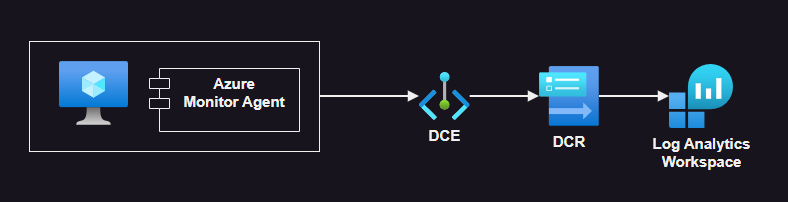

# Azure VM monitoring

Native monitoring with Azure VMs using the Azure Monitor Agent (AMA).

Different methods are implemented in this repository:

- `/infra1` - Data collection (direct configuration with Terraform)
- `/infra2` - Monitor VM Insights
- `/infra3` - Custom Logs / Application + Diagnosis (incoming)

To setup each project variables:

```sh
cp config/local.auto.tfvars .auto.tfvars
```

## Infra 1️ - Data Collection Rules



For the Azure Monitor Agent, check the [requirements][1].

- Permissions
- Authentication / Identity (Managed Identity)
- Networking / Azure Firewall

Run the from `./infra1` directory:

```sh
terraform init
terraform apply -auto-approve
```

The agent is configured via [Data Collection Rules][2]. Check the documentation for details.

Collection options are `Linux Syslog`, `Performance Counters`,  and custom `TXT` or `JSON`.

## Infra 2 - VM Insights

Another method of monitoring VMs is via [Monitor VM Insights][3]

Create the keys:

```sh
mkdir .keys && ssh-keygen -f .keys/temp_rsa
```

The startup code is in the `./infra2` directory:

```sh
terraform init
terraform apply -auto-approve
```

Once completed, connect to the VM and check if Docker has been installed correctly.

```sh
cloud-init status
```

> [!TIP]
> VM Insights automation is possible following the [ARM template](https://learn.microsoft.com/en-us/azure/azure-monitor/vm/vminsights-enable?tabs=arm) by Microsoft.

For convenience, use the Portal or other interface to enable **VM Insights**.

Download the [stressbox][4] tool to simulate resource usage:

```sh
sudo docker pull epomatti/stressbox:arm64
sudo docker run -d -p 8080:8080 epomatti/stressbox:arm64
```

Simulate CPU consumption:

```sh
for i in {1..100}; do curl 0:8080/cpu?x=42; done
```

## Example 3

From the [documentation][5]:

- Virtual machine host
- Guest operating system
- Workloads
- Applications

Configuration steps covered here:

1. Deploy Azure Monitor agent - Deploy the Azure Monitor agent to your Azure and hybrid virtual machines to collect data from the guest operating system and workloads.
2. Configure data collection - Create data collection rules to instruct the Azure Monitor agent to collect telemetry from the guest operating system.

Large infrastructure landscapes should consider Log Analytics Workspace [architecture designs][6].

Operational data is the scope for Azure Monitor. Security data is handle by Microsoft Defender for Cloud (inspector) and Microsoft Sentinel (threat intelligence).

There is a [Diagnostics Extensions][7] available that collects Metrics, Syslog, and Files, and publish them to a storage. There are several [prerequisites][8] (or limitations) and really there are other options available.

Within the same scope, there's [Telegraf Agent][10] integration available. This is not officially supported by Azure Monitor.

The OMS agent is being deprecated in favor of the Azure Monitor Agent, which is used in this example.

The [Network Watcher Agent extension][9] is required by some features of Network Watcher, such as capturing network traffic on demand, and other advanced functionality.

Sentinel:
 - Microsoft Defender for Cloud - Allows the ingestion of Microsoft Defender for Cloud.
 - Microsoft Threat Intelligence - Threat indicators can be malicious IP's, URL's, filehashes, domains, email addresses etc.

https://learn.microsoft.com/en-us/azure/sentinel/connect-services-api-based
https://learn.microsoft.com/en-us/azure/sentinel/connect-services-diagnostic-setting-based
https://learn.microsoft.com/en-us/azure/sentinel/connect-services-windows-based


[1]: https://learn.microsoft.com/en-us/azure/azure-monitor/agents/azure-monitor-agent-manage?tabs=azure-portal
[2]: https://learn.microsoft.com/en-us/azure/azure-monitor/agents/data-collection-rule-azure-monitor-agent?tabs=portal
[3]: https://learn.microsoft.com/en-us/azure/azure-monitor/vm/vminsights-overview
[4]: https://github.com/epomatti/stressbox
[5]: https://learn.microsoft.com/en-us/azure/azure-monitor/vm/monitor-virtual-machine
[6]: https://learn.microsoft.com/en-us/azure/azure-monitor/logs/workspace-design
[7]: https://learn.microsoft.com/en-us/azure/virtual-machines/extensions/diagnostics-linux?toc=%2Fazure%2Fazure-monitor%2Ftoc.json&tabs=azcli
[8]: https://learn.microsoft.com/en-us/azure/virtual-machines/extensions/diagnostics-linux?toc=%2Fazure%2Fazure-monitor%2Ftoc.json&tabs=azcli#prerequisites
[9]: https://learn.microsoft.com/en-us/azure/virtual-machines/extensions/network-watcher-linux?toc=%2Fazure%2Fnetwork-watcher%2Ftoc.json
[10]: https://learn.microsoft.com/en-us/azure/azure-monitor/essentials/collect-custom-metrics-linux-telegraf?tabs=ubuntu
